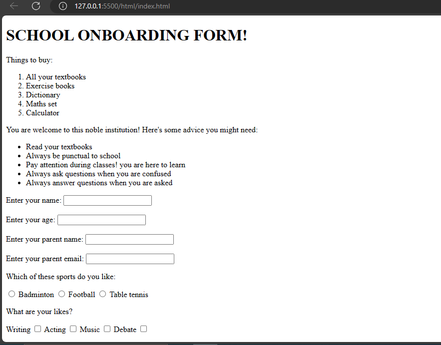

This is a simple webpage built with html only. The exercise are in different sections. Each section is saved as `section[number].html`. This means Section 1 is `section1.html` and so on. 

Here is a preview of the exercise.

This is done using html only although I added some styling for the html table section.